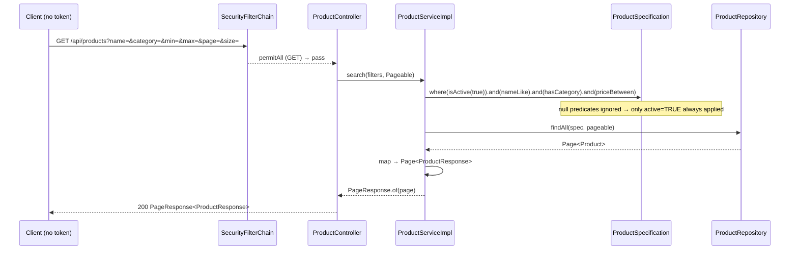
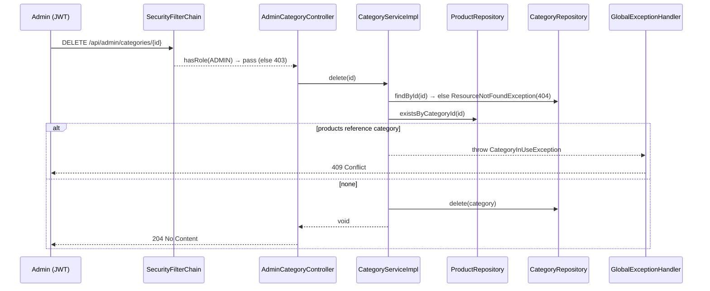

# Design: Catalogo (Product Catalog + Category Management)

## Technical Approach

Purely additive, layered slice mirroring `auth` exactly: `controller → service(interface+impl) → repository → @Entity`. Two resources (product, category), each split into a public read-only controller (`GET` only) and an ADMIN write controller under `/api/admin/**`. Entities are **already** fully mapped to V1 — only code above the model is new. Search/filter via JPA `Specification`; pagination via Spring `Pageable`/`Page<T>` wrapped in a `PageResponse<T>` record. Authorization stays URL-based (one `SecurityConfig` edit), never `@PreAuthorize`. DTOs are records; entities never leave the service boundary.

## Entity completion — NONE REQUIRED (correction)

The brief stated the entities are "bare stubs". Verified false: `model/Product.java` and `model/Category.java` are **already fully annotated** and map every V1 column, including `@ManyToOne(fetch = LAZY, optional = false) @JoinColumn(name = "category_id")` and `@Column(unique = true)` on `sku`/`name`. With `ddl-auto: validate` the app boots and auth tests pass against these. **No entity edits, no migration (no V4).**

## Component Map

| Class | Layer | Action | Responsibility |
|-------|-------|--------|----------------|
| `controller/ProductController` | web | new | `GET /api/products` (search+filter+paginate, active only), `GET /api/products/{id}` |
| `controller/AdminProductController` | web | new | `POST/PUT/DELETE /api/admin/products` |
| `controller/CategoryController` | web | new | `GET /api/categories`, `GET /api/categories/{id}` |
| `controller/AdminCategoryController` | web | new | `POST/PUT/DELETE /api/admin/categories` |
| `service/ProductService` (+`impl/ProductServiceImpl`) | service | new | search, get, create (SKU unique, stock bootstrap), update (no stock mutation), soft-delete |
| `service/CategoryService` (+`impl/CategoryServiceImpl`) | service | new | list, get, create (name unique), update, delete (referential guard) |
| `spec/ProductSpecification` | util | new | static factories `nameLike/hasCategory/priceBetween/isActive`; each returns `null` when filter absent |
| `repository/ProductRepository` | data | modify | add `JpaSpecificationExecutor<Product>`, `existsBySku`, `existsBySkuAndIdNot`, `existsByCategoryId` |
| `repository/CategoryRepository` | data | modify | add `existsByName`, `existsByNameAndIdNot` |
| `dto/request/ProductRequest`, `CategoryRequest` | dto | new | Bean Validation records |
| `dto/response/ProductResponse`, `CategoryResponse`, `PageResponse<T>` | dto | new | output records; `PageResponse` exposes content+page+size+totalElements+totalPages |
| `mapper/ProductMapper`, `CategoryMapper` | mapper | new | `@Component`, manual `toResponse` |
| `exception/DuplicateSkuException`, `DuplicateCategoryNameException` | exception | new | RuntimeException → 409 |
| `exception/GlobalExceptionHandler` | exception | modify | add two `@ExceptionHandler` → `409 CONFLICT` |
| `config/SecurityConfig` | config | modify | one line: `GET` permitAll on catalog reads |

### DTO contracts (records, mirror `auth`)

- `ProductRequest(@NotBlank @Size(max=60) sku, @NotBlank @Size(max=150) name, @Size(max=2000) description, @NotNull @DecimalMin("0.0") @Digits(12,2) price, @NotNull @Min(0) Integer stock, @Size(max=500) imageUrl, @NotNull Long categoryId)`
- `ProductResponse(Long id, String sku, String name, String description, BigDecimal price, int stock, String imageUrl, boolean active, Long categoryId, String categoryName)`
- `CategoryRequest(@NotBlank @Size(max=80) name, @Size(max=255) description)`; `CategoryResponse(Long id, String name, String description)`
- `PageResponse<T>(List<T> content, int page, int size, long totalElements, int totalPages)` + `static <T> PageResponse<T> of(Page<T> p)`

## Authorization wiring (one edit)

`/api/admin/**` is already `hasRole("ADMIN")`; admin paths are `/api/admin/products` and `/api/admin/categories`, so writes are covered with no change. Public reads only need GET opened. Insert **before** `anyRequest().authenticated()` (and it does not collide with the admin matcher since prefixes differ):

```java
.requestMatchers(HttpMethod.GET, "/api/products/**", "/api/categories/**").permitAll()
```

`HttpMethod.GET` ensures only reads are public; any non-GET to those paths still hits `anyRequest().authenticated()`. Mechanism is identical to auth (URL-based, stateless JWT), no annotations.

## Sequence Diagram — (a) public product search



## Sequence Diagram — (b) ADMIN category delete (referential guard)



## Architecture Decisions

| Decision | Choice | Rejected | Rationale |
|----------|--------|----------|-----------|
| Search/filter | JPA `Specification` + `JpaSpecificationExecutor` + `ProductSpecification` factories | Derived-query explosion; Querydsl; manual JPQL `@Query` | Composable optional predicates (`where().and()` drops `null`s); zero new deps (proposal forbids Querydsl); type-safe vs string JPQL |
| Pagination shape | `PageResponse<T>` record | Expose Spring `Page<T>` | Page serialization is unstable across Spring versions and leaks framework internals; explicit record = stable API contract |
| Product delete | **Soft delete** (`active=false`) | Hard `delete()` | `active` already exists and public reads already hide inactive; mirrors auth's "baja lógica" (`User.setStatus`); forward-compatible with future cart/order FKs to products |
| Category delete | **Hard delete + service guard** | Soft delete; rely on DB FK error | Categories are structural reference data, not transactional; `existsByCategoryId` guard in service returns clean 409 instead of opaque 500 from FK violation |
| Guard placement | Service layer (`CategoryServiceImpl.delete`) | Controller; DB constraint only | Business rule belongs in service; controller stays thin; mirrors auth's `LastAdminException` placement |
| Stock boundary | Settable only at create (bootstrap); update mapper ignores `stock` | Allow stock in update | Inventory mutation is a future `stock_movement`-audited feature; catalog must never silently mutate stock |

## Testing Strategy (Strict TDD: RED→GREEN→REFACTOR)

| Layer | What | Approach |
|-------|------|----------|
| Unit | `ProductServiceImpl` (duplicate SKU→409, update leaves stock untouched, delete sets active=false), `CategoryServiceImpl` (duplicate name→409, delete guard throws when `existsByCategoryId`) | JUnit 5 + Mockito, mock repo interfaces; assert exceptions + verify no stock write |
| Web slice | 4 controllers: public GET 200, admin status codes (201/204), validation 400, 409 mapping via `GlobalExceptionHandler` | `@WebMvcTest` + `@MockBean` services, mirror auth slice tests |
| Integration | Public GET no token = 200 & only `active=TRUE`; spec filters + real pagination; SKU/name uniqueness at DB; category delete guard; non-ADMIN→403 on `/api/admin/**` | Spring Boot Test + Testcontainers **PostgreSQL** (not H2) |

**Shared-container isolation**: reuse one singleton Testcontainers Postgres across classes; clean `products` then `categories` (FK order) per test (`@Sql` or `@AfterEach`) so leftover catalog rows never break auth FK tests.

## Migration / Rollout

No migration. Schema V1 already complete; entities already mapped; `ddl-auto: validate` unchanged. Rollback = `git revert` of the single commit (endpoints + the one `SecurityConfig` line).

## Open Questions

None — all decisions settled.
