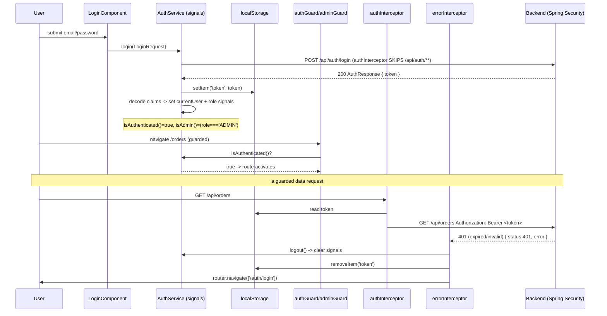

# Design: Frontend Foundation — Angular SPA Skeleton

> SDD DESIGN phase. Source: proposal #348, explore #347. Artifact store: hybrid. Date: 2026-06-15.
> Resolves the 3 open decisions left by the proposal. Recommendations below are for user review.

## Technical Approach

Standalone Angular SPA (no NgModules), Signals as the single source of auth truth, two functional
interceptors and two functional guards. Contract-first: TS DTO mirrors before any screen. One isolated
backend `@Configuration` adds a CORS `CorsConfigurationSource` bean wired into the existing Spring
Security chain. No domain screen renders by design — only a layout shell.

## Resolved Decisions (the 3 open questions)

### Decision 1 — Test runner: **Jest** (via `jest-preset-angular`)

| Option | Tradeoff | Verdict |
|--------|----------|---------|
| Karma + Jasmine | Zero config but DEPRECATED in Angular 18+; browser runner, slow | Reject — deprecated debt |
| **Jest** | Headless, fast, huge docs, snapshot support, gradeable; needs one-time wiring | **CHOOSE** |
| Vitest | Fastest but experimental for Angular 18, thin community | Reject — risk in academic scope |

**`test_command` (frontend): `npm test`** → resolves to `jest` (script `"test": "jest"` in `package.json`).
For CI/single-run determinism use `npm test -- --ci`. This feeds the SDD testing config for apply/verify.
Rationale: Karma is dead weight on Angular 18+; Jest is the best-documented, most defensible choice for a
graded EFSRT deliverable and gives fast RED-GREEN cycles for strict TDD on services/guards.

### Decision 2 — Angular version: **pin Angular 18 (latest 18.x patch)**

Rationale: ≥18 dodges the Karma deprecation called out in explore. 18 (not 19/20) is the conservative,
well-documented LTS-grade choice for the project lifecycle; standalone APIs, `signal/computed`, functional
interceptors/guards, and `provideHttpClient(withInterceptors(...))` are all stable. Pin the major in
`package.json` (`"@angular/core": "~18.x"`) so a stray `ng update` cannot drift the contract mid-project.

### Decision 3 — Strict-TDD stance for the frontend

| Layer | TDD stance | Why |
|-------|-----------|-----|
| Services (AuthService) | **Strict RED-GREEN** | Pure logic; `HttpClient` mockable via `HttpTestingController` |
| Guards (Auth/Admin) | **Strict RED-GREEN** | Pure predicate over signals; `TestBed.runInInjectionContext` |
| Interceptors (Auth/Error) | **Strict RED-GREEN** | Pure `HttpInterceptorFn`; assert header / redirect via mocks |
| Components (Navbar/Footer) | **Pragmatic render-test, critical paths only** | DOM + change detection add friction; test auth-reactive Navbar branches, not pixel layout |

Concretely for TASKS: every service/guard/interceptor task writes a failing spec FIRST. Components get one
render spec covering the auth-state branches (logged-out vs logged-in vs admin) and nothing more.

## Folder Structure

```
frontend/src/
  environments/
    environment.ts            # apiBaseUrl: 'http://localhost:8080'
    environment.prod.ts       # placeholder
  app/
    app.config.ts             # provideRouter, provideHttpClient(withInterceptors([authInterceptor, errorInterceptor]))
    app.routes.ts             # all routes as lazy stubs
    app.component.ts          # shell: <app-navbar><router-outlet><app-footer>
    core/
      auth/
        auth.service.ts       # signals + login/register/logout + rehydrate
        auth.service.spec.ts
      interceptors/
        auth.interceptor.ts   errorInterceptor.ts  (+ .spec.ts each)
      guards/
        auth.guard.ts  admin.guard.ts  (+ .spec.ts each)
    models/
      auth.model.ts product.model.ts cart.model.ts order.model.ts api.model.ts report.model.ts
    shared/                   # empty placeholder (filled by downstream changes)
    layout/
      navbar/ navbar.component.ts (+ .spec.ts)   footer/ footer.component.ts
```

Interceptors + guards + AuthService live under `core/` (singleton, app-wide). Models in one flat `models/`
dir (rejected per-feature models — `OrderResponse` is shared by client + admin features).

## State with Signals

AuthService owns three private writable signals exposed read-only, plus `computed` derived state:

```ts
private readonly _currentUser = signal<UserResponse | null>(null);
private readonly _role = signal<Role | null>(null);
readonly currentUser = this._currentUser.asReadonly();
readonly role = this._role.asReadonly();
readonly isAuthenticated = computed(() => this._currentUser() !== null);
readonly isAdmin = computed(() => this._role() === 'ADMIN');   // raw 'ADMIN', NOT 'ROLE_ADMIN'
```

NavbarComponent consumes `isAuthenticated()` / `isAdmin()` directly in the template (signal reads are
reactive, no async pipe). `login()` sets both signals; `logout()` clears them and storage.

## Token Persistence: **localStorage** (with documented academic-scope rationale)

| Option | Tradeoff | Verdict |
|--------|----------|---------|
| **localStorage** | Survives reload/new tab; XSS-readable | **CHOOSE** — best UX for the demo; XSS risk documented, not in scope |
| sessionStorage | Cleared on tab close; same XSS surface | Reject — worse demo UX, no real security gain |
| in-memory | No XSS persistence; lost on every reload | Reject — login wouldn't survive a refresh; bad for a graded demo |

Security note (documented, out of scope): a JWT in `localStorage` is readable by any injected script. The
production-grade fix is an httpOnly cookie, which the current stateless-bearer backend does not issue. The
backend is the source of trust — the decoded role claim is used for NAVIGATION/DISPLAY only, never as a
security decision (the server re-validates every request).

**Rehydration on boot**: `app.config.ts` registers an `provideAppInitializer`/constructor step where
AuthService reads the token from `localStorage` on construction; if present and not expired (decode `exp`),
it repopulates `_currentUser` (from decoded claims: `sub`→email, `role`) and `_role`. If absent/expired it
clears storage. This makes a page refresh keep the user logged in without a network call.

## Functional Interceptors (`HttpInterceptorFn`) — ORDER MATTERS

Registered in `app.config.ts`: `withInterceptors([authInterceptor, errorInterceptor])`.
Order is **auth FIRST, error LAST** so the request is mutated (Bearer attached) before it flies, and the
response unwinds through `errorInterceptor` on the way back.

- `authInterceptor`: if URL matches `/api/auth/**` → pass through untouched (login/register are public and
  attaching a stale token can poison them). Otherwise read token from storage; if present, clone the request
  adding `Authorization: Bearer <token>`.
- `errorInterceptor`: `catchError` on the response. `401` → AuthService.logout() (clear signals + storage) +
  `router.navigate(['/auth/login'])`. `403` → surface "no tienes permiso" (toast/console for now) and stay.
  Re-throw for other statuses so callers can handle. Reads `ApiError.error` string for the message.

## Functional Guards (`CanActivateFn`)

- `authGuard`: `inject(AuthService).isAuthenticated()` → true, else `router.createUrlTree(['/auth/login'])`.
- `adminGuard`: `isAuthenticated() && role() === 'ADMIN'` → true, else redirect to `/` (or `/auth/login` if
  not authenticated). **Compares raw `'ADMIN'`** — the JWT claim is `"role":"ADMIN"`, NOT `"ROLE_ADMIN"`
  (confirmed in `JwtService.generateToken` → `.claim("role", user.getRole().name())`).

## Type Mapping (Java → TS)

| Java | TS | Note |
|------|-----|------|
| `Long` / `Integer` | `number` | safe |
| `BigDecimal` (price, total, subtotal, unitPrice) | `number` | **precision**: JS `number` is IEEE-754 double; large/many-decimal money values can lose precision. Academic-scope limitation — format display with `DecimalPipe`. Production fix = string serialization. |
| `Instant` (createdAt, orderDate, updatedAt) | `string` | **ISO 8601 string** — see verification below |
| `enum Role` | `'CLIENTE' \| 'ADMIN'` | string union |
| `enum OrderStatus` | `'PENDIENTE' \| 'CONFIRMADA' \| 'CANCELADA'` | string union |

**Instant verification (CORRECTS explore risk #4)**: I inspected `application.yml` — `spring.jackson.
serialization.write-dates-as-timestamps` is NOT set, and there is NO custom `ObjectMapper` bean or
`@JsonFormat` in production code. Spring Boot's `JacksonAutoConfiguration` disables
`WRITE_DATES_AS_TIMESTAMPS` by default, so `Instant` serializes as an **ISO 8601 string**
(e.g. `"2026-06-15T20:46:36.123456Z"`), NOT epoch ms as explore assumed.
**Verification step (TASKS must include)**: after CorsConfig + a real login, hit a `UserResponse`-returning
endpoint and assert `typeof createdAt === 'string'` and that `new Date(createdAt)` is valid. Lock the TS
type to `string` only after this round-trip confirms format. Angular `DatePipe` parses ISO strings natively.

## CorsConfig.java — Integration with the EXISTING Spring Security Chain

The backend HAS Spring Security in the filter chain (`SecurityConfig.filterChain`), so the correct approach
is a **`CorsConfigurationSource` bean + `http.cors(...)` in the existing chain** — NOT `WebMvcConfigurer.
addCorsMappings`.

**Why not `WebMvcConfigurer.addCorsMappings`**: that path runs at the MVC layer, AFTER the security filter
chain. With Spring Security present, preflight `OPTIONS` and cross-origin requests are evaluated by the
security filters first; MVC-level CORS mappings are not consistently honored and preflights can be rejected
before reaching MVC. The Spring-Security-native `http.cors()` wires CORS as a filter INSIDE the chain, which
is the documented pattern when Security is in play.

Two concrete changes:

1. **New** `pe.com.krypton.config.CorsConfig` (`@Configuration`) exposing:
```java
@Bean
CorsConfigurationSource corsConfigurationSource() {
    CorsConfiguration c = new CorsConfiguration();
    c.setAllowedOrigins(List.of("http://localhost:4200"));   // dev origin ONLY
    c.setAllowedMethods(List.of("GET","POST","PUT","PATCH","DELETE","OPTIONS"));
    c.setAllowedHeaders(List.of("Authorization","Content-Type"));
    c.setExposedHeaders(List.of("Content-Disposition")); // for report blob downloads (downstream)
    c.setAllowCredentials(true);
    UrlBasedCorsConfigurationSource s = new UrlBasedCorsConfigurationSource();
    s.registerCorsConfiguration("/**", c);
    return s;
}
```

2. **Modify** `SecurityConfig.filterChain` — add ONE line enabling CORS so the bean is picked up. Insert at
   the top of the `http` builder chain, before `.csrf(...)`:
```java
.cors(Customizer.withDefaults())   // picks up the CorsConfigurationSource bean above
```
   (add imports `org.springframework.security.config.Customizer`). Dev-origin scoped; tighten/parameterize
   the origin via config for any non-dev deployment.

## Sequence Diagram — login → persist → guarded nav → request → 401



## File Changes

| File | Action | Description |
|------|--------|-------------|
| `frontend/` scaffold (`ng new`, standalone, SCSS) | Create | Angular 18, Jest preset |
| `frontend/src/environments/environment.ts` | Create | `apiBaseUrl` |
| `frontend/src/app/app.config.ts` | Create | router + httpClient + interceptors order |
| `frontend/src/app/app.routes.ts` | Create | lazy stub routes + guards |
| `frontend/src/app/models/*.ts` | Create | DTO mirrors (6 files) |
| `frontend/src/app/core/auth/auth.service.ts` | Create | signals, login/register/logout, rehydrate |
| `frontend/src/app/core/interceptors/*.ts` | Create | authInterceptor, errorInterceptor |
| `frontend/src/app/core/guards/*.ts` | Create | authGuard, adminGuard |
| `frontend/src/app/layout/navbar|footer` | Create | shell, auth-reactive navbar |
| `backend/.../config/CorsConfig.java` | Create | `CorsConfigurationSource` dev allowlist |
| `backend/.../config/SecurityConfig.java` | Modify | add `.cors(Customizer.withDefaults())` |

## Testing Strategy

| Layer | What | Approach |
|-------|------|----------|
| Unit | AuthService, guards, interceptors | Strict TDD; `HttpTestingController`, mocked Router/storage |
| Component | Navbar auth branches | Pragmatic render spec, critical paths only |
| Integration (backend) | CORS preflight | Add a MockMvc test asserting `OPTIONS` from `localhost:4200` returns the CORS headers |

## Migration / Rollout

No migration. Greenfield frontend + one additive `@Configuration` + one line in `SecurityConfig`. Rollback =
delete `CorsConfig.java`, revert the `.cors(...)` line, drop `frontend/src/app`.

## Open Questions

- [ ] Confirm Instant ISO format against a LIVE response during apply (design predicts ISO 8601 string from
      Jackson defaults — verification step is mandatory in TASKS, not a blocker).
